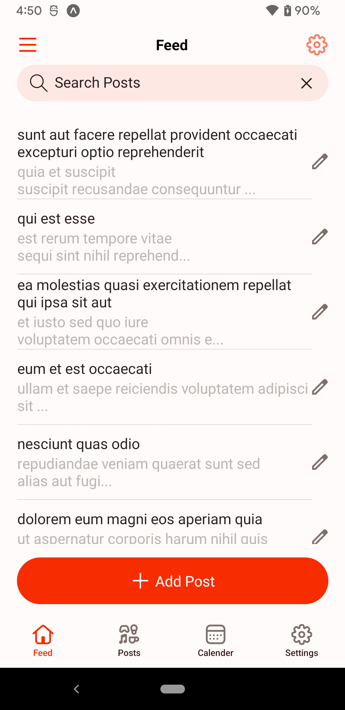
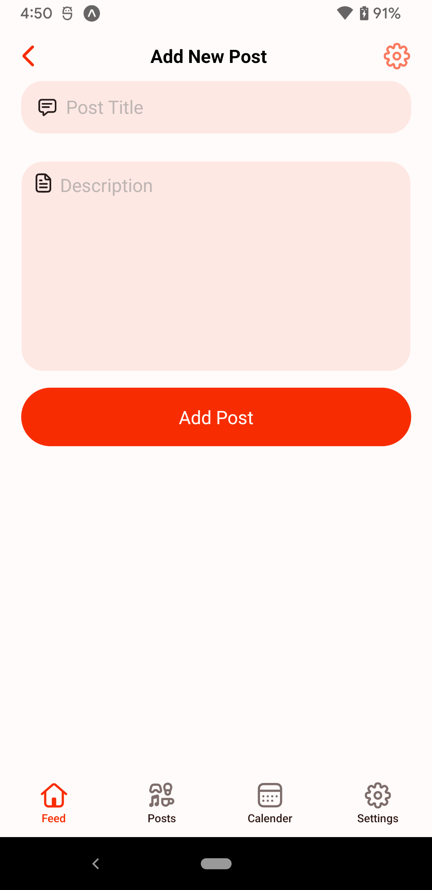
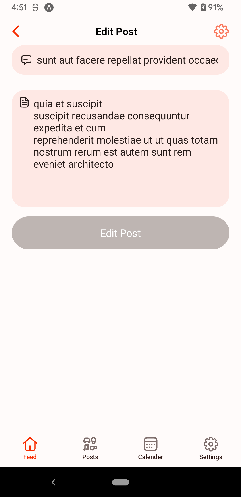

# Tech network [iLabs Test Task ]

## Screenshots

<div align="center">
  
  
  
</div>

## Description
Tech network is a mobile application developed using **React Native Expo**. Designed for both iOS and Android platforms, it offers seamless cross-platform compatibility and a modern user experience.

---

## Table of Contents
- [Introduction](#introduction)
- [Features](#features)
- [My Approach](#my-approach)
- [Getting Started](#getting-started)
- [Project Structure](#project-structure)

---

## Introduction

This project leverages **React Native Expo**, an open-source framework that simplifies the development of cross-platform mobile applications. Expo provides built-in modules and tools to streamline app creation, testing, and deployment.

---

## Features

- **Cross-Platform Compatibility**: Works flawlessly on both iOS and Android.
- **Responsive Design**: Ensures optimal usability across various device sizes.

---

## My Approach

## Planning

- Carefully analyzed the project requirements and outlined the application workflow.  
- Broke the project down into smaller, manageable tasks to streamline development and ensure efficiency.

---

## Development Process

- Started the project using a **React Native Expo TypeScript template** for a quick and organized setup.  
- Structured the codebase modularly, separating components, screens, and utilities for better organization and scalability.  
- Designed a nested navigation structure for seamless app navigation.  
- Developed custom hooks to handle API calls, reducing unnecessary re-renders and improving performance.  
- Configured **Expo Application Services (EAS)** to build APKs and AABs efficiently.  
- Implemented an Axios interceptor for streamlined and consistent API communication.  
- Created constant files for managing app-wide text, endpoints, themes, validations, SVGs, and environment variables.  
- Established a global styling structure to simplify and unify the styling process.  
- Organized navigation in a tree-based structure for clarity and scalability.  
- Applied TypeScript wherever possible to ensure strong typing and reduce errors.  
- Prioritized responsive UI design by leveraging Expo’s layout utilities and testing on various devices.

---

## Coding Practices

- Focused on writing **clean, maintainable, and reusable code**, adhering to industry best practices.  
- Avoided inline styles by utilizing **StyleSheet** to maintain consistency and reduce clutter.  
- Centralized all text in JSON files to simplify localization and future updates.  
- Ensured the app's maintainability by breaking down components into logical, reusable units.

---

## Getting Started

Follow these steps to set up and run the project:

1. **Clone the Repository**
   ```bash
   git clone https://github.com/MuneebQureshi1/ILabs_Test_Task.git
   cd ILabs_Test_Task
2. **Install Dependencies**
   ```bash
   npm install

3. **Run Project**
   ```bash
   expo start
